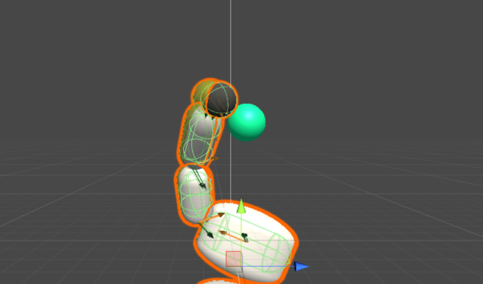
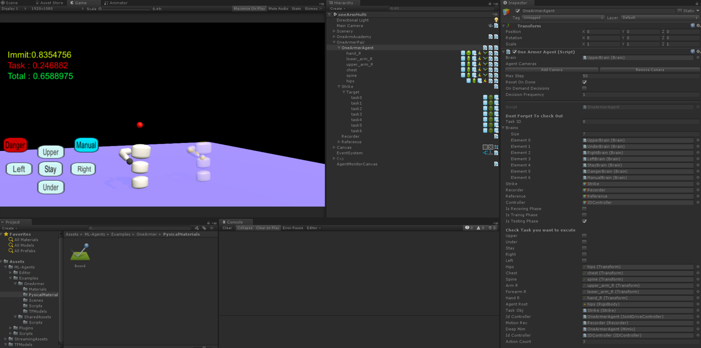

## Demo

## Features

MultiTaskOneArmerAgent inspired by Example Guided Deep Reinforcement learning Deepmimic
This white reinforcement learned agent satisfy immitation of yellow referenceground truth motion)
* Immitation Objective
* Additional task objective
Be able to  choose below 7 Different Mode with your gui.
・4 Independently Trained Task +WaitMode+Manual Mode with keyboard input+dangerous(not trained enough) Mode.

## Documentation

* For more information, in addition to installation and usage instructions, see my website below.
* Performance & Concept
https://qiita.com/tanakataiki/items/94c7778341a40438cc99 
* Enviroment Setting
https://qiita.com/tanakataiki/items/40f54b3851c2ed3e09ec
* Unity C#
https://qiita.com/tanakataiki/items/fbb3a4782add01d73428
* Tensorflow Search
https://qiita.com/tanakataiki/private/8655c76b68933905f3ea

* If you are a researcher interested in a discussion of this project let me know !
* If you have used a version of the ML-Agents toolkit prior to v0.5, we strongly
  recommend our [guide on migrating from earlier versions](docs/Migrating.md).

## License

Copyright March 2019 Taiki Tanaka
MIT https://opensource.org/licenses/MIT

Also This Repo Includes Unity ML-Agent License [Apache License 2.0](LICENSE)

## Citation

If you use MultiTask Armer Agent to conduct research, we ask that you cite this website as a reference.

If you use Unity or the ML-Agents Toolkit to conduct research, we ask that you cite the following paper as a reference:

Juliani, A., Berges, V., Vckay, E., Gao, Y., Henry, H., Mattar, M., Lange, D. (2018). Unity: A General Platform for Intelligent Agents. *arXiv preprint arXiv:1809.02627.* https://github.com/Unity-Technologies/ml-agents.

## Reference
* Paper:https://xbpeng.github.io/projects/DeepMimic/2018_TOG_DeepMimic.pdf
* Blog : https://bair.berkeley.edu/blog/2018/04/10/virtual-stuntman/
* Code : https://github.com/xbpeng/DeepMimic

## Acknowledgement
This reinforcement learning projet is under the support of SE4 inc 

Thanks for Loki Savkin and Andri
